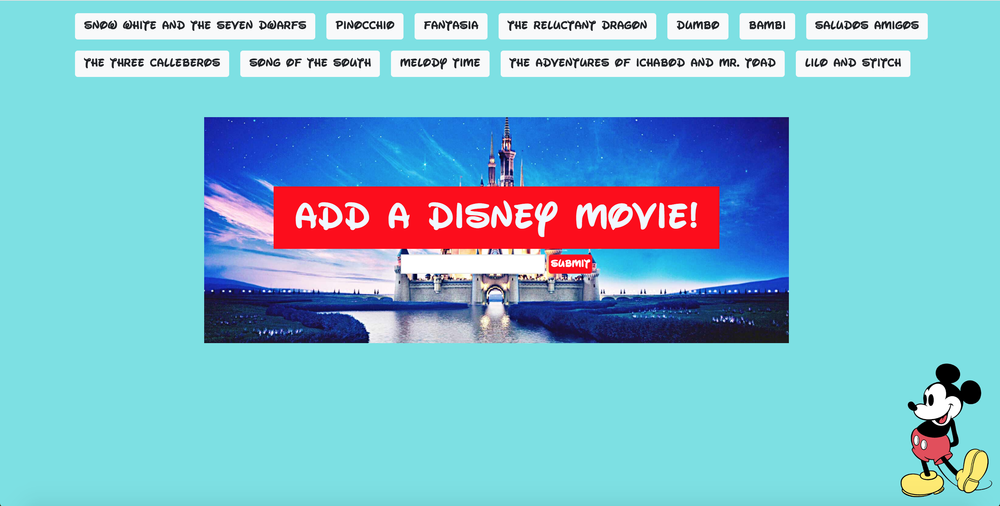

# GifTastic

GifTastic is a GIF generating application that utilizes the GIPHY API, JQuery, HTML, and CSS. 

## Summary
There are preset Disney movies at the top which you may click on to generate the GIF's for that movie.
It says to add a Disney Movie, but you can really type anything into this. Once you submit a new movie, or phrase, it will add a new button which you may click once more to generate the GIFs. Of the GIFs generated, you have to click them to start them for they appear in their stills. You may also click again to stop the animation. Each GIF also appears with it's audience rating for your convenience. 

## Screenshots of the Application

### Screenshot of the Home
This is the landing page of the application with it's default buttons. 

### Screenshot After Pressing a Buttom
After pressing the Lilo and Stitch button, these are the GIFs generated.

### Screenshot of Adding a Button
Screenshot after adding the Incredibles button and generating the GIFs for it. 

